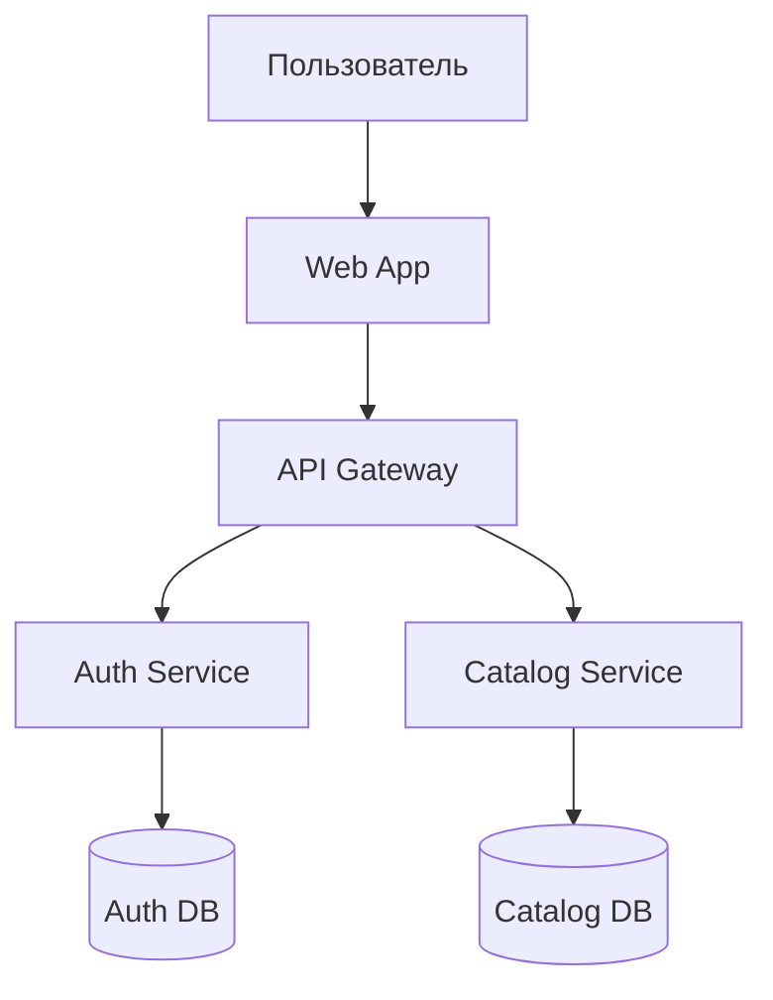
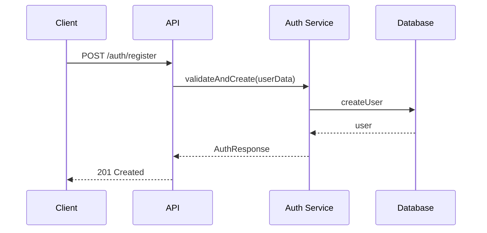

# WORKFLOW.md

Этот документ описывает единый, максимально подробный способ совместной работы над сервисами: от требований и архитектуры до типов, контрактов, реализации и управления состоянием. Используется type-first подход, строгий TypeScript, Zod-схемы, модульная архитектура, ветвление по модулям, управление состоянием на стороне клиента (state management), и диаграммы на Mermaid.

## Цели и принципы

- **Type-first**: типы определяют архитектуру и контракты.
- **Zero-any**: запрещен any; контролируемый unknown только с type guards и пояснениями.
- **exactOptionalPropertyTypes**: отсутствие undefined в передаваемых объектах.
- **Модульность**: слабая связанность, события/контракты между модулями.
- **Документирование**: JSDoc для публичных типов/функций; диаграммы на Mermaid.
- **Репозитории данных**: единственная точка доступа к БД; мапперы БД ↔ домен.
- **Валидность на границах**: Zod для runtime валидации и трансформаций.
- **Обязательное управление состоянием**: через отдельные хранилища (zustand/jotai).

## Структура репозитория

```
project-name/
├── README.md                      # Общее описание проекта (назначение, обзор)
├── docs/
│   ├── ARCHITECTURE.md           # Архитектура: слои, модули, события, интеграции
│   ├── USER_STORIES.md           # Пользовательские истории (вход от заказчика)
│   ├── USE_CASES.md              # Варианты использования, сценарии (основные/альтернативные)
│   ├── TECH_REQUIREMENTS.md      # Функциональные/нефункциональные требования
│   ├── TECH_STACK_DISCUSSION.md  # Обсуждение выбора стека и обоснование
│   ├── TECH_DECISIONS.md         # ADR — журнал архитектурных решений
│   ├── DIAGRAMS.md               # Mermaid: контекст, контейнеры, ER, последовательности, состояния
│   ├── DATABASE_SCHEMA.md        # Схема БД (ER) и миграции высокого уровня
│   ├── API_CONTRACTS.md          # API контракты, статусы, ошибки, примеры запрос/ответ
│   ├── EVENTS.md                 # Событийная модель, версии, инварианты, идемпотентность
│   ├── TYPE_POLICY.md            # Политика типизации (null-политика, JSDoc, правила)
│   ├── MODULE_GUIDE.md           # Гайд по устройству модулей (структура, контракты, паттерны)
│   └── WORKFLOW.md               # Этот документ (процесс работы)
├── src/
│   ├── schemas/                  # Zod схемы валидации
│   ├── stores/                   # Глобальные stores
│   └── modules/
│       └── <module-name>/
│           ├── api/
│           ├── services/
│           ├── repositories/
│           ├── stores/           # Модульные stores
│           ├── types/
│           ├── events/
│           └── components/       # UI компоненты (если есть)
├── package.json
└── tsconfig.json
```

## Ветвление, коммиты, PR

- Основная ветка: main (защищенная).
- Ветки разработки: feature/module-<name> и feature/module-<name>-<task>.
- Коммиты: feat(module-<name>): … | fix(module-<name>): … | refactor(module-<name>): …
- PR: заголовок "[module-<name>] Краткое описание"; в описании — фичи, контракты (API/Events), миграции, риски, обратная совместимость, чек-лист DoD.

## Этапы процесса

### 1) User Stories → Use Cases

- USER_STORIES.md: "Как [роль], я хочу [что], чтобы [зачем]".
- USE_CASES.md: детальные сценарии (основные/альтернативные), предусловия, постусловия, ошибки.

Пример (USER_STORIES.md):
- Как новый пользователь, я хочу зарегистрироваться по email, чтобы получить доступ к платформе.

Пример (USE_CASES.md):
- UC-001: Регистрация пользователя — шаги 1..N; альтернативы A1..An; статусы ошибок.

### 2) Обсуждение технологического стека

- TECH_REQUIREMENTS.md: функциональные и нефункциональные требования (нагрузка, latency, доступность, безопасность).
- TECH_STACK_DISCUSSION.md: матрицы сравнений (Next.js/Nest/Fastify; Prisma/Drizzle/RAW SQL; NextAuth/Supabase/Auth0; Zustand/Jotai/Redux и т.д.), критерии с весами, компромиссы, план миграций.
- TECH_DECISIONS.md (ADR): фиксируем принятое решение, контекст, последствия.

Рекомендуемые базовые выборы (для web-платформы):
- Frontend/SSR: Next.js 14 (App Router) + TypeScript.
- Backend для MVP: Next.js API Routes; при росте — выделение в сервис (Fastify/Nest).
- БД: PostgreSQL; ORM — Prisma или Drizzle (выбор фиксируется в ADR).
- Валидация: Zod (runtime) + TS (compile-time).
- State Management: Zustand (предпочтительно) или Jotai.
- Аутентификация: NextAuth или Supabase Auth (ADR фиксирует).
- Хранилище файлов: S3-совместимое (Supabase Storage/MinIO).
- Кеш: Redis (later-on).
- Хостинг: Vercel (MVP), далее VPS/Docker Compose/K8s при росте.

### 3) Архитектура и диаграммы (Mermaid)

DIAGRAMS.md должен содержать минимум:
- Контекстная диаграмма (C4 level 1)
- Диаграмма контейнеров/модулей (C4 level 2)
- ER диаграмма БД
- Sequence диаграммы ключевых сценариев
- Диаграмма состояний для важных доменов (например, жизненный цикл пользователя/заказа)

Примеры:

Контекст:


ER:
```mermaid
erDiagram
    USER { uuid id PK; string email UK; string password_hash; string name; timestamp created_at; }
    USER_PROFILE { uuid user_id PK,FK; json preferences; json stats; string avatar_url; }
    USER ||--|| USER_PROFILE : has
```

Sequence:


### 4) Типы и Zod-схемы

Политика типизации (TYPE_POLICY.md):
- Запрет any; unknown только с guards и пояснениями.
- exactOptionalPropertyTypes: никаких undefined ключей в DTO — используем условные спреды.
- Null-политика: отсутствующие значения — null, не undefined.
- JSDoc обязателен для публичных типов/функций/событий.

Организация схем:
```
src/
  schemas/
    user.schemas.ts
    auth.schemas.ts
    common.schemas.ts
```

Пример schema-first:
```ts
import { z } from 'zod';

export const CreateUserSchema = z.object({
  email: z.string().email('Невалидный email'),
  password: z.string().min(8, 'Минимум 8 символов'),
  name: z.string().min(2, 'Минимум 2 символа'),
  preferences: z.object({
    language: z.enum(['ru', 'en']).default('ru'),
    notifications: z.boolean().default(true)
  }).optional()
});

export type CreateUserRequest = z.infer<typeof CreateUserSchema>;
```

Валидация на границе (API):
```ts
export async function POST(request: Request) {
  const json = await request.json();
  const parsed = CreateUserSchema.safeParse(json);
  if (!parsed.success) {
    return NextResponse.json({ errors: parsed.error.format() }, { status: 400 });
  }
  const data = parsed.data; // Типобезопасно
  // ...
}
```

Трансформация БД → домен:
```ts
const DbUserSchema = z.object({
  id: z.string().uuid(),
  email: z.string().email(),
  password_hash: z.string(),
  name: z.string(),
  preferences: z.union([z.string(), z.record(z.unknown())])
    .transform((v) => typeof v === 'string' ? JSON.parse(v) : v)
    .pipe(z.object({
      language: z.enum(['ru', 'en']).default('ru'),
      notifications: z.boolean().default(true)
    })),
  created_at: z.coerce.date(),
});
export type DbUser = z.infer<typeof DbUserSchema>;
```

Композиция и версии контрактов:
```ts
const BaseUserSchema = z.object({
  id: z.string().uuid(),
  email: z.string().email(),
  name: z.string(),
});
export const UserResponseV1 = BaseUserSchema.extend({
  preferences: z.object({ language: z.string(), notifications: z.boolean() }),
});
```

### 5) State Management (Zustand/Jotai)

#### Принципы управления состоянием:
- **Type-safe stores**: все состояние строго типизировано
- **Модульные stores**: отдельный store для каждого домена/модуля  
- **Predictable updates**: четкие actions и селекторы
- **Separation of concerns**: UI логика отделена от бизнес-логики
- **DevTools integration**: возможность отладки состояния

#### Структура stores:
```
src/
  stores/
    user/
      user.store.ts          # Состояние пользователя
      user.types.ts          # Типы для store
      user.selectors.ts      # Селекторы (если нужны)
    catalog/
      catalog.store.ts       # Каталог произведений
      catalog.types.ts
      catalog.actions.ts     # Сложные actions
    ui/
      ui.store.ts           # UI состояние (модалы, sidebar)
    index.ts                # Re-export всех stores
```

#### Пример типизированного store (Zustand):
```typescript
// src/stores/user/user.types.ts
export interface User {
  id: string;
  email: string;
  name: string;
  preferences: UserPreferences;
}

export interface UserState {
  currentUser: User | null;
  isLoading: boolean;
  error: string | null;
}

export interface UserActions {
  setUser: (user: User) => void;
  updatePreferences: (preferences: Partial<UserPreferences>) => void;
  clearUser: () => void;
  fetchUser: (id: string) => Promise<void>;
  updateProfile: (data: UpdateUserRequest) => Promise<void>;
}

export type UserStore = UserState & UserActions;
```

```typescript
// src/stores/user/user.store.ts
import { create } from 'zustand';
import { devtools, persist } from 'zustand/middleware';
import { immer } from 'zustand/middleware/immer';
import type { UserStore, User } from './user.types';
import { userService } from '@/services/user.service';

export const useUserStore = create<UserStore>()(
  devtools(
    persist(
      immer((set, get) => ({
        currentUser: null,
        isLoading: false,
        error: null,
        setUser: (user: User) => {
          set((state) => {
            state.currentUser = user;
            state.error = null;
          });
        },
        updatePreferences: (preferences) => {
          set((state) => {
            if (state.currentUser) {
              state.currentUser.preferences = {
                ...state.currentUser.preferences,
                ...preferences
              };
            }
          });
        },
        clearUser: () => {
          set((state) => {
            state.currentUser = null;
            state.error = null;
          });
        },
        fetchUser: async (id: string) => {
          set((state) => {
            state.isLoading = true;
            state.error = null;
          });
          try {
            const result = await userService.getUser(id);
            if (result.ok) {
              set((state) => {
                state.currentUser = result.data;
                state.isLoading = false;
              });
            } else {
              set((state) => {
                state.error = result.error.message;
                state.isLoading = false;
              });
            }
          } catch (error) {
            set((state) => {
              state.error = error instanceof Error ? error.message : 'Unknown error';
              state.isLoading = false;
            });
          }
        },
        updateProfile: async (data) => {
          const currentUser = get().currentUser;
          if (!currentUser) throw new Error('No current user');
          set((state) => { state.isLoading = true; });
          try {
            const result = await userService.updateProfile(currentUser.id, data);
            if (result.ok) {
              set((state) => {
                state.currentUser = result.data;
                state.isLoading = false;
              });
            } else {
              set((state) => {
                state.error = result.error.message;
                state.isLoading = false;
              });
            }
          } catch (error) {
            set((state) => {
              state.error = error instanceof Error ? error.message : 'Unknown error';
              state.isLoading = false;
            });
          }
        }
      })),
      {
        name: 'user-store',
        partialize: (state) => ({
          currentUser: state.currentUser
        })
      }
    ),
    { name: 'UserStore' }
  )
);
```

### 6) Паттерны и функции-заглушки

Папки модуля:
```
src/modules/<module>/{types, repositories, services, api, events, stores}
```

Контракты:
```ts
export interface User { /* ... */ }
export interface UserPreferences { /* ... */ }
export interface UserRepository {
  create(data: CreateUserData): Promise<User>;
  findById(id: string): Promise<User | null>;
  findByEmail(email: string): Promise<User | null>;
}
export interface UserService {
  register(req: RegisterRequest): Promise<ApiResult<AuthResponse>>;
  login(req: LoginRequest): Promise<ApiResult<AuthResponse>>;
}
export interface DomainEvent { type: string; version: 'v1'; timestamp: Date; }
export interface UserCreatedEvent extends DomainEvent {
  type: 'user.created'; userId: string; email: string;
}
```

Функции-заглушки (скелет):
```ts
export async function registerUser(
  repo: UserRepository,
  input: RegisterRequest
): Promise<ApiResult<AuthResponse>> {
  // 1) Валидация input (Zod)
  // 2) Проверка уникальности email
  // 3) Хеширование пароля
  // 4) repo.create(...) и публикация UserCreatedEvent
  // 5) Возврат токенов
  throw new Error('Not implemented');
}
```

### 7) Definition of Done (DoD) для модуля

- Типы и контракты стабильны, задокументированы (JSDoc).
- API валидируется Zod; корректные статусы 400/401/403/404/409/422/500.
- Репозитории инкапсулируют доступ к БД; мапперы БД ↔ домен.
- Событийные обработчики идемпотентны (idempotency key), описаны в EVENTS.md.
- **State management реализован**: stores созданы, типизированы, с middleware.
- Healthcheck модуля и feature flag включения.
- Документация (ARCHITECTURE.md, API_CONTRACTS.md, DIAGRAMS.md) обновлена.

## Политика ошибок и результатов API

Стандартный конверт ответа:
```ts
export type ApiResult<T> =
  | { ok: true; data: T }
  | { ok: false; error: { code: string; message: string; details?: unknown } };
```

Коды:
- 400 Bad Request — валидация/формат.
- 401 Unauthorized — нет или неверная аутентификация.
- 403 Forbidden — недостаточно прав.
- 404 Not Found — ресурс не найден.
- 409 Conflict — конфликт уникальности/состояния.
- 422 Unprocessable Entity — корректный синтаксис, неверная семантика.
- 500 Internal Server Error — прочие ошибки сервера.

## Событийная модель

Принципы:
- Версионирование событий (v1, v2…).
- Идемпотентность обработчиков.
- Повторная доставка не нарушает инварианты.
- Back-pressure и ретраи — по возможности best-effort.

Пример контракта:
```ts
export interface ReadingActivityEvent {
  type: 'reading.activity';
  version: 'v1';
  userId: string;
  workId: string;
  chapterNumber: number;
  timeSpent: number;
  completionPercentage: number;
  source: 'web' | 'extension' | 'mobile';
  timestamp: string;
}
```

## Безопасность и соответствие

- Аутентификация: короткоживущие JWT, обязательная email-верификация.
- Авторизация: RBAC/ABAC — фиксируется в ADR.
- Валидация: 100% входящих данных через Zod на границах.
- Санитизация: все пользовательские вводы, защита XSS/CSRF.
- Лимиты: rate limiting на критичных эндпоинтах.
- Аудит: пишем значимые экономические/безопасностные операции.

## Мониторинг и эксплуатация

- Healthchecks per-module.
- Структурированные логи, correlation-id.
- Метрики производительности API, активность пользователей.
- Планируемая миграция: от монолита к микросервисам при росте.

## Чек-листы

### На старт проекта
- [ ] Создан README.md и docs/*
- [ ] Заполнены USER_STORIES.md и USE_CASES.md
- [ ] Проведено обсуждение стека (включая state management), оформлены ADR
- [ ] Подготовлены базовые диаграммы

### На старт модуля
- [ ] Создана ветка feature/module-<name>
- [ ] Определены доменные типы, Zod-схемы и store интерфейсы
- [ ] Скелеты функций и контрактов готовы (пустые реализации)
- [ ] API_CONTRACTS.md, EVENTS.md и store описания обновлены

### На завершение модуля (DoD)
- [ ] Типы стабильны, JSDoc добавлен
- [ ] Валидация и статусы корректны
- [ ] Репозитории/мапперы реализованы
- [ ] **State stores реализованы и типизированы**
- [ ] События и обработчики — идемпотентны
- [ ] Диаграммы и документация обновлены
- [ ] PR описан и прошел ревью

## Нотации и правила стиля

- TypeScript strict, никакого any.
- **Обязательное использование zustand/jotai для state management.**
- unknown только с явными type guards и пояснением причины.
- exactOptionalPropertyTypes: без undefined в payload'ах.
- JSDoc обязателен для публичных API/событий/типов.
- Имена веток, коммитов, PR по правилам в этом документе.
- Zod — единый инструмент для схем/валидации/трансформации.

---

Эта инструкция является источником правды для всех участников и инструментов (включая нейросети). Следование ей гарантирует единый стиль проектирования, типобезопасность и предсказуемость разработки.